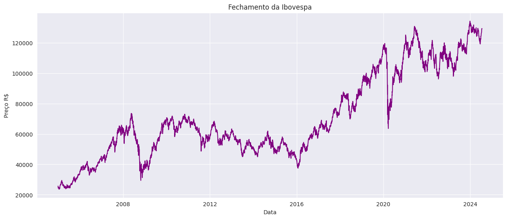
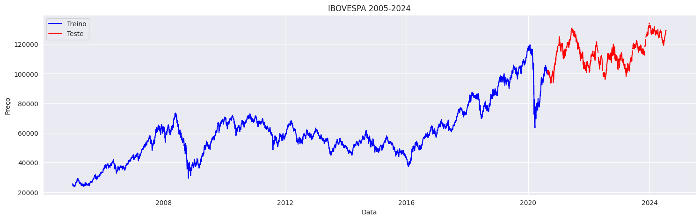
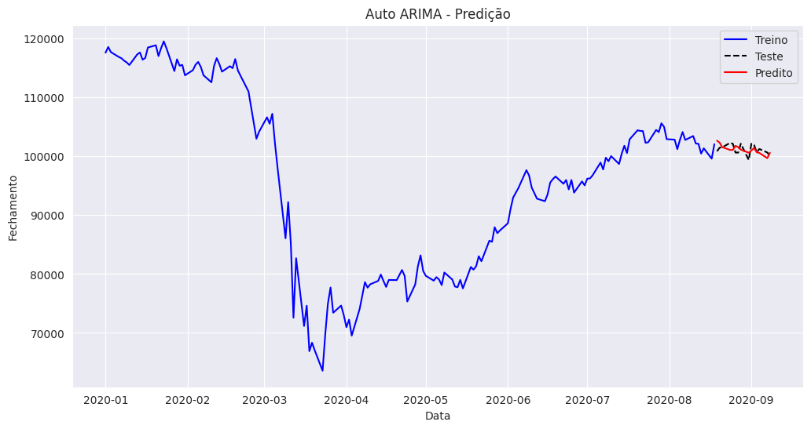
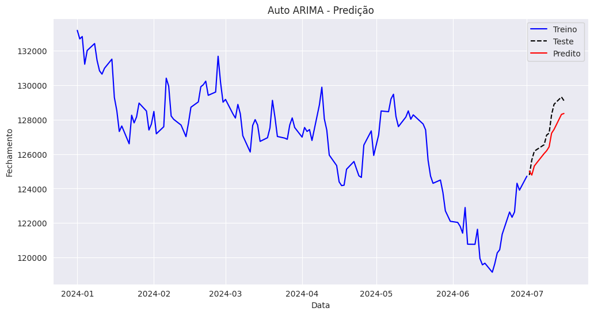
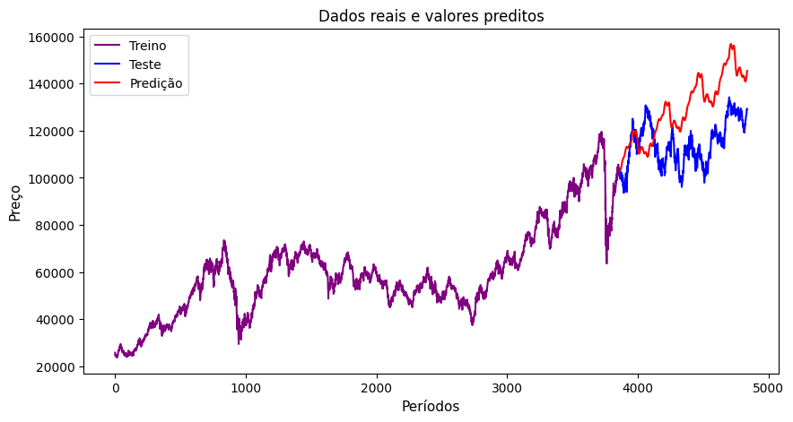
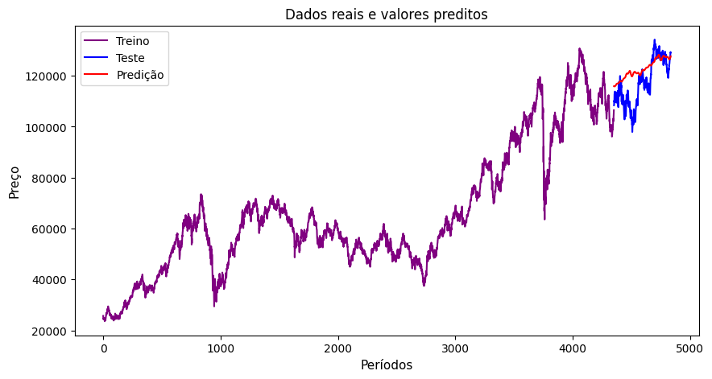

# **Projeto - Previsão IBOVESPA**

**Proposta do Projeto**
---
Realizar um modelo preditivo com dados da IBOVESPA(Bolsa de valores) para criar uma série temporal e prever diariamente o fechamento da base.

**Contexto**
---

Neste projeto, analisamos e previmos investimentos utilizando dados de 2005 a 2024, extraído do IBOVESPA, o principal indicador de desempenho das ações negociadas na B3, sendo a bolsa de valores oficial do Brasil.
Dividimos os dados em períodos anuais e, posteriormente, em intervalos de 180 dias, para identificar padrões e tendências de mercado. Aplicamos modelos de previsão para intervalos de 3 a 15 dias, com o objetivo de melhorar a precisão e entender as variações de curto prazo. Esta abordagem detalhada visa aprimorar a tomada de decisão em investimentos financeiros.

**Modelos Testados**
---

* Arima
* Prophet
* Sarima
* Naive
  
**Resultados**
---

Para a análise foram coletados dados de preços (máximos, mínimos, aberturas e fechamentos) em  periodicidades diárias, conforme pode-se observar no gráfico. Destaca-se que a base histórica possui oscilações ao longo do período. Sendo identificadas quedas significativas no fechamento da IBOVESPA em 2009, 2016 e 2019. Essas quedas estão relacionadas com a crise imobiliária mundial iniciada nos Estados Unidos, a  crise na política brasileira e a pandemia do COVID-19, respectivamente.

* **Modelos Arima e Prophet**

Após os tratamentos pertinentes na base  foi realizada a divisão dos dados entre treino e teste. Sendo que foi utilizado 80% para treino e 20% para teste. 

* **Realizando as previsões com o Modelo Arima**

Inicialmente utilizou-se a predição para os próximos 15 dias (utilizando 80% treino e 20% teste). Este apresentou um RMSE (Root Mean Squared Error) de 1%. 

Posteriormente, realizando predição para os próximos 15 dias (base de treino (03-01-2005 - 01/07/2024)). Obtendo-se um RMSE (Root Mean Squared Error) de 1,3%. 

O modelo Auto Arima apresentou bons resultados quando utilizado para prever poucos dias.

* **Realizando as previsões com o Modelo Prophet**

Inicialmente utilizou-se a predição para os próximos 15 dias (utilizando 80% treino e 20% teste). Este apresentou um RMSE (Root Mean Squared Error) de 16%. 

Posteriormente, realizando predição para os próximos 15 dias (utilizando 95% treino e 5% teste). Obtendo-se um RMSE (Root Mean Squared Error) de 6%. 

O modelo Prophet apresentou bons resultados.

Principais motivos : 
1) Complexidade do mercado de ações : O mercado de ações é altamente volátil e influenciado por fatores imprevisíveis, como notícias, eventos políticos e mudanças econômicas.
2) Limitações de tendência linear : Os modelos assumem uma tendência de crescimento não linear, mas muitas ações têm padrões mais complexos. A tendência linear pode não se ajustar bem a esses dados.
3) Previsões de longo prazo : Os modelos são mais adequados para previsões de curto a médio prazo. 

**Conclusões**
---

**Referências Bibliográficas**
---
SILVEIRA, P. H. M. (2019). O que move o preço da ação? Um estudo sobre as maiores variações diárias do Ibovespa na década de 2010.

